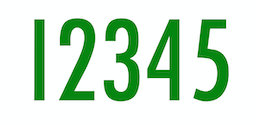

# Solve12345
Solves the game 12345 using brute force

## How to play 12345
Given the numbers 1-5, manipulate the numbers using the allowed operations to come to a target number.

Allowed operations: addition, subtraction, multiplication, division, exponentiation

### Example
Number: 187

Possible solution: 4 ^ (1 + 2) * 3 - 5

Another solution: 4 ^ 3 * (1 + 2) - 5 = 187

etc.

## Solver
This program is a solver for 12345 that brute forces all possible results. It has three modes
depending on which lines you decomment.

### Mode 1
Get the number of solutions for all possible puzzles up to 200

### Mode 2
Get all the solutions for a single target number